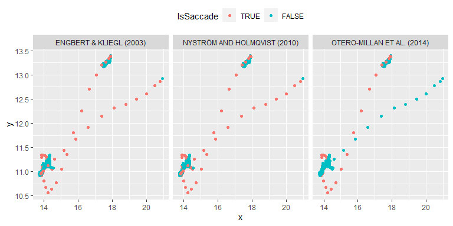
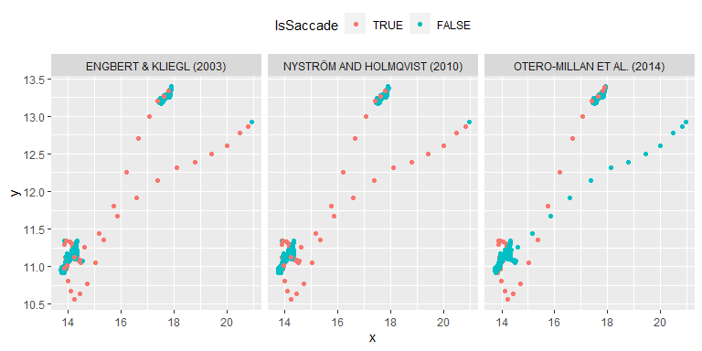
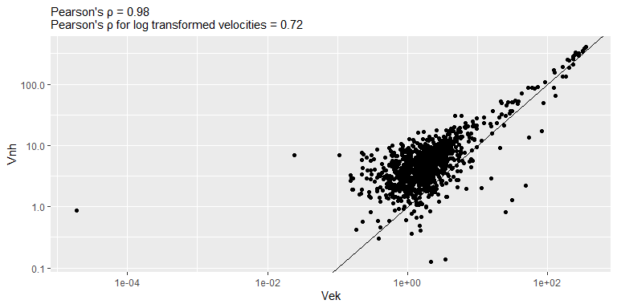
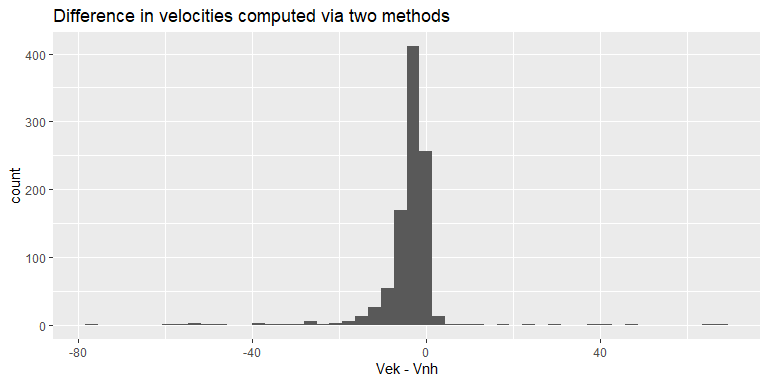

# Summary
The package uses an ensemble of methods approach to label individual samples and then applies a majority vote approach to identify saccades. The package includes three methods (see [Implemented Methods](#implemented-methods)) but can be extended via custom methods (see [Using custom methods](#using-custom-methods)). It also uses a modular approach to compute velocity and acceleration from noisy samples (see [Velocity computation](#velocity-computation)). Finally, you can obtain methods votes per gaze sample instead of saccades (see [Using sample votes](#using-sample-votes)).

The `extract_saccades()` function uses several methods to label individual samples as belonging to a saccade, classifies a sample as a potential saccade if its proportion of votes exceeds a preset threshold, and then identifies saccades based on minimal saccade duration and minimal time between the saccades. For binocular data, 1) samples can be averaged _before_ velocity computation, 2) votes can be merged so that methods return binocular saccades, or 3) saccades are extracted for each eye separately.

Currently, the library implements saccade detection using the following methods (when using this package, please cite both the package and individual methods):

* `method_ek` : Engbert, R., & Kliegl, R. (2003). Microsaccades uncover the orientation of covert attention. Vision Research, 43(9), 1035–1045. https://doi.org/10.1016/S0042-6989(03)00084-1
* `method_om` : Otero-Millan, J., Castro, J. L. A., Macknik, S. L., & Martinez-Conde, S. (2014). Unsupervised clustering method to detect microsaccades. Journal of Vision, 14(2), 18–18. https://doi.org/10.1167/14.2.18
* `method_nh` : Nyström, M., & Holmqvist, K. (2010). An adaptive algorithm for fixation, saccade, and glissade detection in eye tracking data. Behavior Research Methods, 42(1), 188–204. https://doi.org/10.3758/BRM.42.1.188

# Statement of Need
Although there is an agreement about a general definition of a [saccade](https://en.wikipedia.org/wiki/Saccade), the more specific details are harder to agree upon. Therefore, there are numerous algorithms that extract saccades based on various heuristics, which differ in the assumptions about velocity, acceleration, etc. An ensemble approach addresses this issue by combining votes from various methods making saccade detection less dependent on specific assumptions. It also allows the user to set how liberal the criterion for saccade detection is, i.e., how many methods need to agree for a sample to be marked as a potential saccade. In addition, it will make studies easier to compare as it allows to use individual methods separately to compare results within and across studies.

# Usage
The main function is `extract_saccades()`. Minimally, it  takes x and y gaze samples, and sampling rate returning a table with extracted saccades. Note that the function expects that units of the gaze samples are in **degrees of visual angle**, as some methods use physiologically plausible velocity and acceleration thresholds.
```r
data("single_trial")
saccades <- extract_saccades(single_trial$x, single_trial$y, sample_rate = 500)
```
## Multiple trials
When the recording spans multiple trials, you need to specify this via `trial` parameter. This way velocity computation and saccade detection methods respect trial boundaries.

```r
data(monocular_ten_trials)
saccades <- extract_saccades(monocular_ten_trials$x
                             monocular_ten_trials$y, 
                             500,
                             trial = monocular_ten_trials$trial)
```

## Binocular data

There are three ways in which binocular data can be treated based on the value of the `binocular` parameter:

* `binocular = "merge"` (default): sample votes are obtained from both eyes and for all methods and then averaged. This way only binocular saccades (i.e., eye movements with sufficient temporal overlap between eyes) are detected. `Eye = "Binocular"` in saccade description.
* `binocular = "cyclopean"`: binocular data is converted to an average cyclopean image before voting and saccades detection. `Eye = "Cyclopean"` in saccade description.
* `binocular = "monocular"`: saccades are extracted independently for each eye. `Eye = "Left"` or `Eye = "Right"` in saccade description.

```r
data("single_trial_binocular")
# binocular saccades only
saccades_b <- saccadr::extract_saccades(single_trial_binocular[, c('xL', 'xR')],
                                      single_trial_binocular[, c('yL', 'yR')],
                                      sample_rate = 1000)

# cyclopean saccades from binocular data
saccades_c <- saccadr::extract_saccades(single_trial_binocular[, c('xL', 'xR')],
                                      single_trial_binocular[, c('yL', 'yR')],
                                      sample_rate = 1000,
                                      binocular = "cyclopean")

# monocular saccades from binocular data
saccades_m <- saccadr::extract_saccades(single_trial_binocular[, c('xL', 'xR')],
                                      single_trial_binocular[, c('yL', 'yR')],
                                      sample_rate = 1000,
                                      binocular = "monocular")
```

## Specifying methods
By default, all implemented methods are used for saccade detection but, if necessary, you can use their subset or even a single method. Note that you can also supply your customized saccade detection function, please see [Using custom methods](#using-custom-methods).

```r
# Using a single method
saccades <- extract_saccades(single_trial$x, single_trial$y, 500, methods = method_om)

# Using two methods
saccades <- extract_saccades(single_trial$x, single_trial$y, 500, methods = list(method_ek, method_om))
```

Individual methods have their own parameters that are passed via `options` argument, which is a named list with `<parameter-name> = <value>` pairs. You can find information on specific parameters and their default values in [Implemented Methods](#implemented-methods). Here is an example of modifying a velocity threshold, measured in units of standard deviation, for Engbert & Kliegl (2003) method. The default value is 6 but we can make it stricter

```r
saccades <- extract_saccades(single_trial$x, single_trial$y, 500, options = list("ek_velocity_threshold" = 8))
```

## Altering voting threshold
The voting threshold is the number of methods that must label a sample as a potential saccade. By default, all but one method must agree for a sample to be considered for a saccade (`vote_threshold = length(methods) - 1`) but is 1, if only a single method was passed to the function. You can make voting more or less restrictive via the `vote_threshold` parameter.

```r
# A strict unanimous decision threshold
saccades <- extract_saccades(single_trial$x, single_trial$y, 500, vote_threshold = 3)

# A slacker criterion that at least one of the three methods must label a sample as a saccade
saccades <- extract_saccades(single_trial$x, single_trial$y, 500, vote_threshold = 1)
```

## Specifying velocity computation method
Because the gaze samples tend to be noisy, different methods use various approaches for computing velocity from noisy samples. Methods by Engbert & Kliegl (2003) and  Otero-Millan et al. (2014) used the same approach based on averaging over multiple samples to compute velocity, whereas Nyström & Holmqvist (2010) compute a simple derivative and then filter it. By default, package uses the former approach (`velocity_function = diff_ek`) but you can also use the latter (`velocity_function = diff_nh`) or implement a custom method (see [Velocity computation](#velocity-computation)). Acceleration is computed the same way but from velocity samples. Here is an example of using Nyström & Holmqvist (2010) velocity computation

```r
saccades <- extract_saccades(single_trial$x, single_trial$y, 500, velocity_function = diff_nh)
```

## Specifying saccade temporal properties
Once the votes are in, saccades detection is based on their minimal duration (`minimal_duration_ms` parameter, defaults to 12 ms) and minimal time between the saccades (`minimal_separation_ms`, defaults to 12 ms).

```r
# Only longish saccades are extracted
saccades <- extract_saccades(single_trial$x, single_trial$y, 500, minimal_duration_ms = 20)
```

## Return values
### Saccade description table
The `extract_saccades()` function returns a table with following columns:

* `Trial` Trial index.
* `Eye` "Monocular" for monocular inputs. "Cyclopean" for binocular data that was averaged before applying algorithms. "Binocular" for binocular data with votes averaged after applying algorithms. "Left" or "Right" for binocular data when eyes are processed independently.
* `OnsetSample` Index of the first sample.
* `OffsetSample` Index of the last sample.
* `Onset` Onset time relative to the trial start in milliseconds.
* `Offset` Offset time relative to the trial start in milliseconds.
* `Duration` Duration in milliseconds.
* `DisplacementX` Horizontal displacement measured from the first to the last sample.
* `DisplacementY` Vertical displacement measured from the first to the last sample.
* `Displacement` Displacement magnitude measured from the first to the last sample.
* `DisplacementPhi` Displacement direction measured from the first to the last sample.
* `AmplitudeX` Horizontal displacement measured from the leftmost to the rightmost sample.
* `AmplitudeY` Vertical displacement measured from the lowest to the uppermost sample.
* `Amplitude` Displacement magnitude measured from the most extreme samples.
* `AmplitudePhi` Displacement direction measured from the most extreme samples.
* `VelocityPeak` Peak velocity.
* `VelocityAvg` Average velocity.
* `AccelerationPeak` Peak acceleration.
* `AccelerationAvg` Average acceleration.
* `AccelerationStart` Peak acceleration before peak velocity was reached.
* `AccelerationStop` Peak acceleration after peak velocity was reached.

### Sample votes
Alternatively, if you use parameter `return_votes = TRUE` the function can return votes per sample and method (and eye, for binocular data). Please see [Using sample votes](#using-sample-votes) for details.

# Implemented methods{}
The package implements the following methods

* @EngbertKliegl2003
* @Otero-Millan2014
* @NystromHolmqvist2010

Each method has additional parameters that can be passed via the `options` argument of the `extract_saccades()` function.

## @EngbertKliegl2003
The algorithm labels a sample as a saccade if velocity, measured in units of its standard deviation (see below), exceeds a predefined threshold (defaults to $6$) and the duration of a super-threshold period exceeds a minimal duration (defaults to $12$ milliseconds). This method makes no assumptions about velocity in the units of degrees per second and can be used on any data (e.g., where samples encode gaze in screen position units).

The standard deviation is computed following formula #2 in @EngbertKliegl2003 as
```r
sqrt(median(x^2) - median(x)^2)
```

However, if the value is smaller than [`.Machine$double.eps`](https://stat.ethz.ch/R-manual/R-devel/library/base/html/zMachine.html), it is recomputed via a mean estimator
```r
sqrt(mean(x^2) - mean(x)^2)
```

Only a monocular version of the algorithm is implemented with binocular saccades computed using overlapping votes from two eyes. For method details and rationale for default parameter values refer to @EngbertKliegl2003.

Parameters:

* `ek_velocity_threshold` Velocity threshold for saccade detection in standard deviations. Defaults to $6$.
* `ek_sd_fun` Function used to compute standard deviation for velocities. Defaults to `sd_via_median_estimator()` that implements formula #2 in @EngbertKliegl2003. Can be replaced with `sd()`, `mad()`, or a custom function.
* `ek_minimal_duration_ms` Minimal duration of a saccade in milliseconds. Defaults to $12$.
* `ek_minimal_separation_ms` A minimal required time gap between saccades. Defaults to $12$.

## @Otero-Millan2014
The algorithm:

1. Detect local velocity peaks.
2. Filter them based on a minimal inter-peak interval (defaults to $30$ ms) and maximal allowed saccade rate (defaults to $5$ Hz).
3. Identify the onset and offset of a potential saccade using an absolute velocity threshold in degrees per second (defaults to $3$).
4. Compute peak velocity and peak acceleration before and after the peak velocity was reached.
5. Rotate velocity and peak acceleration via PCA and retain components above a predefined threshold for explained variance (defaults to $0.05$).
6. Perform a cluster analysis on the remaining components for $2$, $3$, and $4$ picking the solution with the smallest silhouette. 
7. Saccades are identified as a cluster with the highest average peak velocity.

For method details and rationale for default parameter values refer to @Otero-Millan2014.

Parameters:

* `om_minimal_inter_peak_time_ms` Minimal inter-peak interval in milliseconds. Defaults to $30$
* `om_maximal_peaks_per_second` Maximal allowed number of peaks per second. Defaults to $5$.
* `om_velocity_threshold_deg_per_sec` Threshold saccade velocity in °/s.  Defaults to $3$.
* `om_pca_variance_threshold` Minimal variance explained by retained rotated components. Defaults to $0.05$.

## @NystromHolmqvist2010

The algorithm:

1. Identify physiologically implausible velocity and acceleration peaks (defaults to $1000 \deg/s$ and $100000 \deg/s^2$).
2. Identify noise onset/offset as samples around the implausible velocity/acceleration that are above median velocity. Exclude these samples from analysis.
3. Identify velocity threshold $PT = mean(V_{subthreshold}) + 6 \cdot std(V_{subthreshold})$ via an iterative method starting at an arbitrary $PT$ value (defaults to $100 \deg/s$). Stop when threshold change is below $1 \deg/s$.
4. Identify saccades as periods with peaks above threshold $PT$ and adjacent samples that are above $PT_{onset/offset} = mean(V_{subthreshold}) + 3 \cdot std(V_{subthreshold})$.

For method details and rationale for default parameter values refer to @NystromHolmqvist2010.

Parameters:

* `nh_max_velocity` Maximal physiologically plausible velocity in °/s. Defaults to `1000`.
* `nh_max_acceleration` Maximal physiologically plausible acceleration in °/s². Defaults to `100000`.
* `nh_initial_velocity_threshold` Initial velocity threshold in °/s. Defaults to `100`.

# Using custom methods
You can pass a custom function to the `extract_saccades()` alongside the internally implemented method. The function must be declared as follows:
```r
custom_saccade_voting_method <- function(x,
                                         y,
                                         vel,
                                         acc,
                                         sample_rate,
                                         trial,
                                         options) {
                                         
  # implement your method that computes a 0/1 vote per sample
  
  sample_votes
}
```

Arguments that are passed to the function (all vectors/tables have the same length/number of rows):

* `x`, `y` vectors with _monocular_ samples (either for one of the eyes or cyclopean). On the one hand, you can assume that samples are in degrees of visual angle as the package users are warned that using non-standard units may invalidate some internally implemented methods. On the other hand, as you are implementing a custom method for your data, you can treat them in the units you see fit (input vectors `x` and `y` are not transformed but for averaging in the case of cyclopean data).
* `vel` and `acc` are data frames with velocity and acceleration samples. Each table has columns `x` (horizontal component), `y` (vertical component), and `amp` (amplitude). See below for details on velocity computation.
* `sample_rate` scalar value in Hz.
* `trial` vector with trial index per sample.
* `options` a named list with method-specific options. See the example below for how to use them. See also `option_or_default()` function.

Your function must return a vector of the same length as `x` with votes ($1$ if the sample belongs to a potential saccade, $0$ otherwise, you can also use logical values).

## Example implementation
Here is an example implementation of an overly simple custom method that labels a sample as a saccade if its velocity exceeds a predefined threshold. It expects the threshold parameter as `"st_velocity_threshold"` member of the list and uses a default threshold of $50 \deg / s$ (an arbitrary number!) if no threshold was provided.

```r
simple_threshold_method <- function(x,
                                    y,
                                    vel,
                                    acc,
                                    sample_rate,
                                    trial,
                                    options) {

  # obtain method parameters or use defaults
  velocity_threshold <- saccadr::option_or_default(options, "st_velocity_threshold", 50)

  # vote on each sample  
  sample_vote <- vel[['amp']] > velocity_threshold
  
  # return votes
  sample_vote
}
```

Once you implemented your method, you can pass it alongside internally implemented methods:
```r
data("single_trial")
saccades <- saccadr::extract_saccades(x = single_trial$x,
                                      y = single_trial$y,
                                      sample_rate = 500,
                                      methods = list("ek", "om", "nh", simple_threshold_method),
                                      options = list("st_velocity_threshold" = 70))
```

# Using sample votes

Function `extract_saccades()` has an option to return sample votes for each method via `return_votes = TRUE` parameter. Here is an example of using them for internally implemented methods.

```r
data("single_trial")

methods_to_use <- list("Engbert & Kliegl (2003)" = method_ek,
                       "Otero-Millan et al. (2014)" = method_om,
                       "Nyström and Holmqvist (2010)" = method_nh)

votes <- extract_saccades(x = single_trial$x,
                          y = single_trial$y,
                          sample_rate = 500,
                          methods = methods_to_use,
                          return_votes = TRUE)

single_trial_with_votes <- list()
for(imethod in 1:length(methods_to_use)){
  single_trial_with_votes[[imethod]] <- single_trial
  single_trial_with_votes[[imethod]]$Method <- toupper(names(methods_to_use)[imethod])
  single_trial_with_votes[[imethod]]$IsSaccade <- votes[, imethod]
  single_trial_with_votes[[imethod]]$IsSaccade <- factor(single_trial_with_votes[[imethod]]$IsSaccade == 1,
                                                         levels = c(TRUE, FALSE))
}

ggplot(do.call("rbind", single_trial_with_votes), 
       aes(x = x, y = y, color = IsSaccade)) +
  geom_point() +
  facet_grid(. ~ Method) +
  theme(legend.position = "top")
```

{width=100%}

Same data but using @NystromHolmqvist2010 to compute velocity and acceleration
```r
votes <- extract_saccades(x = single_trial$x,
                          y = single_trial$y,
                          sample_rate = 500,
                          methods = methods_to_use,
                          velocity_function = diff_nh,
                          return_votes = TRUE)

single_trial_with_votes <- list()
for(imethod in 1:length(methods_to_use)){
  single_trial_with_votes[[imethod]] <- single_trial
  single_trial_with_votes[[imethod]]$Method <- toupper(names(methods_to_use)[imethod])
  single_trial_with_votes[[imethod]]$IsSaccade <- votes[, imethod]
  single_trial_with_votes[[imethod]]$IsSaccade <- factor(single_trial_with_votes[[imethod]]$IsSaccade == 1,
                                                         levels = c(TRUE, FALSE))
}

ggplot(do.call("rbind", single_trial_with_votes), 
       aes(x = x, y = y, color = IsSaccade)) +
  geom_point() +
  facet_grid(. ~ Method) +
  theme(legend.position = "top")
```
{width=100%}

# Velocity computation
Because the gaze samples tend to be noisy, different methods use various approaches for computing velocity from noisy samples. Methods by @EngbertKliegl2003 and @Otero-Millan2014 used the same approach based on averaging over multiple samples to compute velocity, whereas @NystromHolmqvist2010 compute a simple derivative and then filter it. By default, package uses the former approach (`velocity_function = diff_ek`) but you can also use the latter (`velocity_function = diff_nh`) or implement a custom method (see below). Acceleration is computed the same way but from velocity samples.

## Differentiation following @EngbertKliegl2003
This method computes velocity over a predefined time window controlled via `ek_velocity_time_window` that defaults to 20 ms. The width of the window is converted to samples based on the `sampling_rate` parameter and is ensured to be an _odd_ number equal to or larger than 3. I.e., for a window that is three samples long, the velocity is computed based on one sample before and one sample after the current, for a five-samples window - two samples before and after, etc. The code always starts with the requested window size but iteratively reduces it by two samples to accommodate for trial limits and missing values until the largest viable window is found. An `NA` velocity is returned only if even the smallest window (three samples wide) cannot be used.

In general, horizontal and vertical velocity components are computed as
$$v_x[i] = \frac{\sum_{j=1}^{(N-1)/2}x[i+j] - x[i-j]}{\sum_{j=1}^{(N-1)/2}2j\cdot\Delta t}$$
where $i$ is the index of a sample, $\Delta t = \frac{1}{sample~rate}$ is a duration of a single sampling frame, and $N$ is an _odd_ integer width of the moving average used to compute the velocity. In @EngbertKliegl2003, $N=5$ and $\Delta t = 4$ (250 Hz sampling rate) translate into a 20 ms moving average window (default value used in the method implementation). Below is a derivation that shows the equivalence of the formula above to formula 1 in @EngbertKliegl2003.  For $N=5$:
$$\frac{\sum_{j=1}^{(5-1)/2}x[i+j] - x[i-j]}{\sum_{j=1}^{(5-1)/2}2j\cdot\Delta t}=$$
$$\frac{\sum_{j=1}^{2}x[i+j] - x[i-j]}{\sum_{j=1}^{2}2j\cdot\Delta t}=$$

$$\frac{x[i+1] - x[i-1]+x[i+2] - x[i-2]}{2\Delta t + 4\Delta t}=$$
$$\frac{x[i+2] + x[i+1] - x[i-1] - x[i-2]}{6\Delta t}$$

## Differentiation following @NystromHolmqvist2010
Horizontal and vertical components of velocity are computed from adjacent samples, the amplitude is computed from the components and then filtered using the [Savitzky-Golay filter](https://en.wikipedia.org/wiki/Savitzky%E2%80%93Golay_filter). Filter order is controlled via `nh_sg_filter_order` option and defaults to `2`.

## Comparing two methods
The two methods produce comparable but different velocity values. However, this has only a minor effect on saccade detection, see [Using sample votes](#using-sample-votes).

```r
# computing velocity using two methods
vel_ek <- saccadr::diff_ek(x = single_trial$x,
                           y = single_trial$y,
                           trial = rep(1, nrow(single_trial)),
                           sample_rate = 500)
vel_nh <- saccadr::diff_nh(x = single_trial$x,
                           y = single_trial$y,
                           trial = rep(1, nrow(single_trial)),
                           sample_rate = 500)
vel_comparison <- na.omit(data.frame(EK = vel_ek[['amp']], NH = vel_nh[['amp']])) %>%
  dplyr::filter(NH > 0) %>% # values can be negative due to filtering
  dplyr::mutate(logEK = log(EK), logNH = log(NH)) 

# plotting amplitude comparison
pearson_rho <- cor(vel_comparison[['EK']], vel_comparison[['NH']])

ggplot(data = vel_comparison, aes(x = EK, y = NH)) +
  geom_abline() +
  geom_point() +
  scale_x_log10() +
  scale_y_log10() +
  labs(subtitle = sprintf("Pearson's ρ = %.2f\nPearson's ρ for log transformed velocities = %.2f", pearson_rho, cor(vel_comparison[['logEK']], vel_comparison[['logNH']])),
       x = "Vek",
       y = "Vnh")
```
{width=100%}


```r
# plotting difference
ggplot(data = NULL, aes(x = vel_comparison[['EK']] - vel_comparison[['NH']])) +
  geom_histogram(bins = 50) +
  xlab("Vek - Vnh") +
  labs(title = "Difference in velocities computed via two methods")
```
{width=100%}

## Implementing and using a custom differentiation function
A custom function should be as a follows

```r
diff_custom <- function(x, y,  trial, sample_rate, options=NULL) {
  # compute vertical and horizontal components
  df <- data.frame(x = ..., # differentiate values of x 
                   y = ...) # differentiate values of y
  
  # compute amplitude
  df[['amp']] = sqrt(df[['x']]^2 + df[['y']]^2))

  # return a data.frame with columns x, y, and amp
  return(df)
}
```

Arguments that are passed to the function (all vectors have the same length):

* `x`, `y` vectors with values, either x and y gaze coordinates or velocity components (for acceleration).
* `sample_rate` scalar value in Hz.
* `trial` vector with trial index per sample.
* `options` a named list with method-specific options. See the example below for how to use them. See also `option_or_default()` function.

The function must return a data.frame with three columns: `x` (horizontal component), `y` (vertical component), and `amp` (amplitude). 

Here is an example of a simple velocity function that respects trial borders
```r
library(dplyr)

diff_custom <- function(x, y,  trial, sample_rate, options=NULL) {
  # computing frame time step 
  delta_t_s <- 1 / sample_rate
  
  # --- differentiate (compute velocity or acceleration) and filter
  data.frame(trial = trial,
             x = x,
             y = y) %>%

    # compute velocity and acceleration for each trial
    group_by(trial) %>%
    mutate(x = (x - lag(x)) / delta_t_s,
           y = (y - lag(y)) / delta_t_s,
           amp = sqrt(x^2 + y^2))
}
```

And here is a similar function but that uses an optional `custom_velocity_lag` parameter so that it can be different from 1
```r
diff_lag_n <- function(x, y,  trial, sample_rate, options=NULL) {
  # obtain lag or use default
  lag_n <- saccadr::option_or_default(options, "custom_velocity_lag", 1)
  
  # computing frame time step 
  delta_t_s <- 1 / sample_rate
  
  # --- differentiate (compute velocity or acceleration) and filter
  data.frame(trial = trial,
             x = x,
             y = y) %>%

    # compute velocity and acceleration for each trial
    group_by(trial) %>%
    mutate(x = (x - lag(x, lag_n)) / delta_t_s,
           y = (y - lag(y, lag_n)) / delta_t_s,
           amp = sqrt(x^2 + y^2))
}
```

# References

